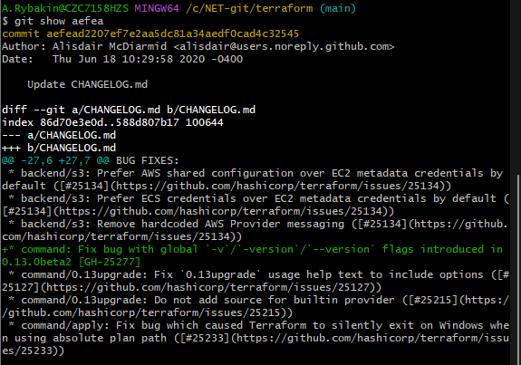
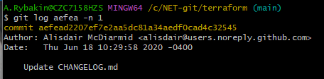
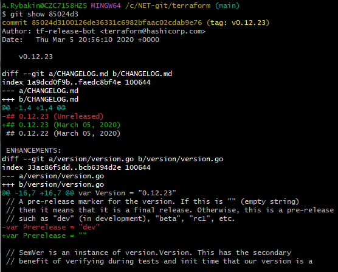
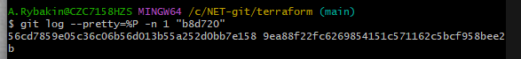
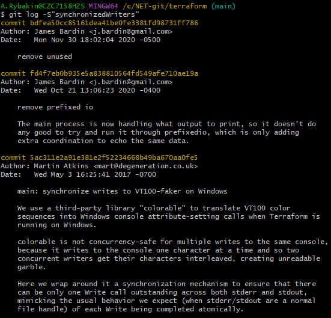

# 14-4 # Домашнее задание к занятию «Инструменты Git» - Рыбакин Алексей

## Задание

В клонированном репозитории:
```
1. Найдите полный хеш и комментарий коммита, хеш которого начинается на `aefea`.
```
<details>
<summary>git show aefea</summary>



</details>

<details>
<summary>git log aefea -n 1</summary>

</details>
```
2. Ответьте на вопросы.
```
```
* Какому тегу соответствует коммит `85024d3`?
```
<details>
<summary>git show 85024d3</summary>

</details>

<details>
<summary>git log aefea -n 1</summary>

</details>
```
* Сколько родителей у коммита `b8d720`? Напишите их хеши.
```
<details>
<summary>git log --pretty=%P -n 1 "b8d720"</summary>

</details>
```
* Перечислите хеши и комментарии всех коммитов, которые были сделаны между тегами  v0.12.23 и v0.12.24.
```
<details>
<summary>git log v0.12.23..v0.12.24 --pretty=oneline</summary>

</details>
```
* Найдите коммит, в котором была создана функция `func providerSource`, её определение в коде выглядит так: `func providerSource(...)` (вместо троеточия перечислены аргументы).
```
<details>
<summary>git grep --count 'func providerSource'</summary>

</details>
```
* Найдите все коммиты, в которых была изменена функция `globalPluginDirs`.
```

<details>
<summary>git grep "globalPluginDirs"</summary>

</details>

```
 * Кто автор функции `synchronizedWriters`? 
```

<details>
<summary>git log -S"synchronizedWriters"</summary>

</details>

*В качестве решения ответьте на вопросы и опишите, как были получены эти ответы.*

---
