# 14-4 # Домашнее задание к занятию «Инструменты Git» - Рыбакин Алексей

### Задание

В клонированном репозитории:

## 1. Найдите полный хеш и комментарий коммита, хеш которого начинается на `aefea`.

Ответ:

git show aefea

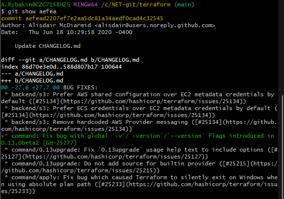

git log aefea -n 1

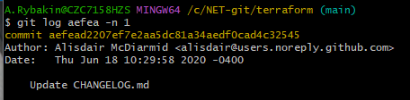

git log --pretty=oneline -1 aefea

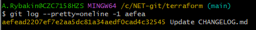

git log --pretty=format:"%H %s" -1 aefea

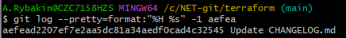

---

## 2. Ответьте на вопросы.

## * Какому тегу соответствует коммит `85024d3`?

Ответ:

git show 85024d3

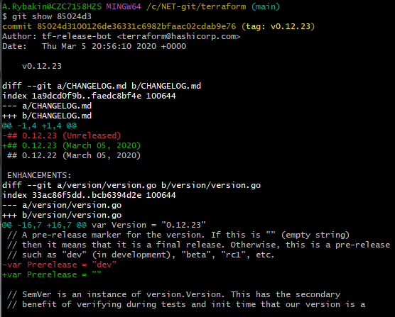

git log aefea -n 1

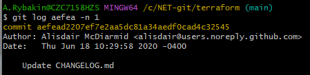

git log --pretty=oneline -1 85024d3

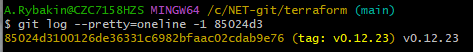

git log --simplify-by-decoration -1 85024d3

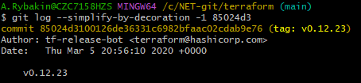

---

## * Сколько родителей у коммита `b8d720`? Напишите их хеши.

Ответ:

git show --pretty=%P b8d720

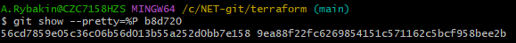

---

## * Перечислите хеши и комментарии всех коммитов, которые были сделаны между тегами  v0.12.23 и v0.12.24.

Ответ:

git log v0.12.23..v0.12.24 --pretty=oneline

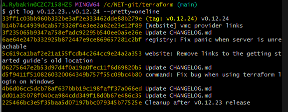

---

## * Найдите коммит, в котором была создана функция `func providerSource`, её определение в коде выглядит так: `func providerSource(...)` (вместо троеточия перечислены аргументы).

Ответ:

git log -S"func providerSource(" --oneline

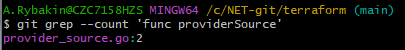

---

## * Найдите все коммиты, в которых была изменена функция `globalPluginDirs`.

Ответ:

git log -S globalPluginDirs --oneline

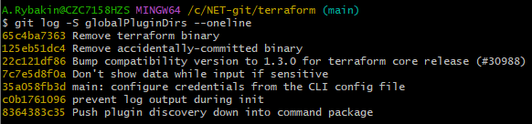

---

 ## * Кто автор функции `synchronizedWriters`? 

Ответ:

git log -S"synchronizedWriters"

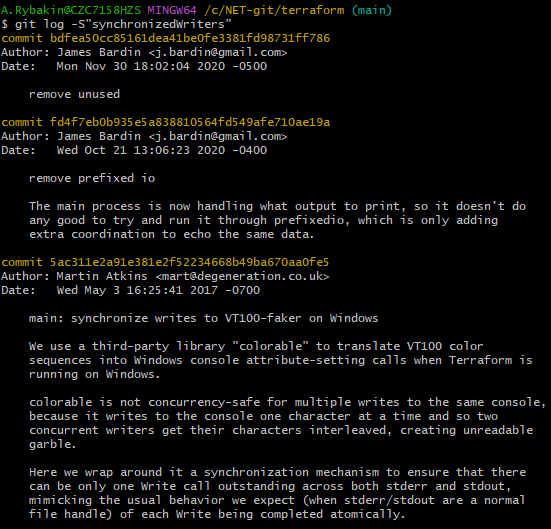

---