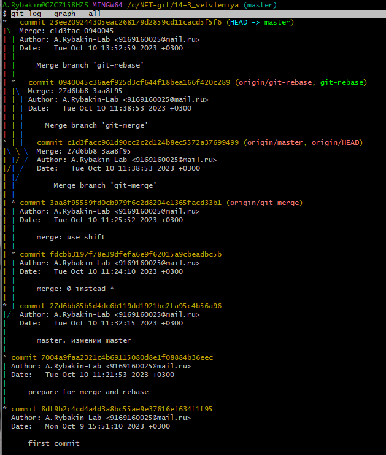
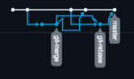

# 14-3_vetvleniya
# Домашнее задание к занятию «Ветвления в Git» - Рыбакин Алексей

Ответ:
За место названия ветки "main" использовал "master". (Сразу это не заметил)

В качестве ответа присылаю скрин "git log --graph --all"

Сам ход процеса попунктно расписан в задании.

Ссылка на График 
https://github.com/RybakinAE-Hub/14-3_vetvleniya/network

